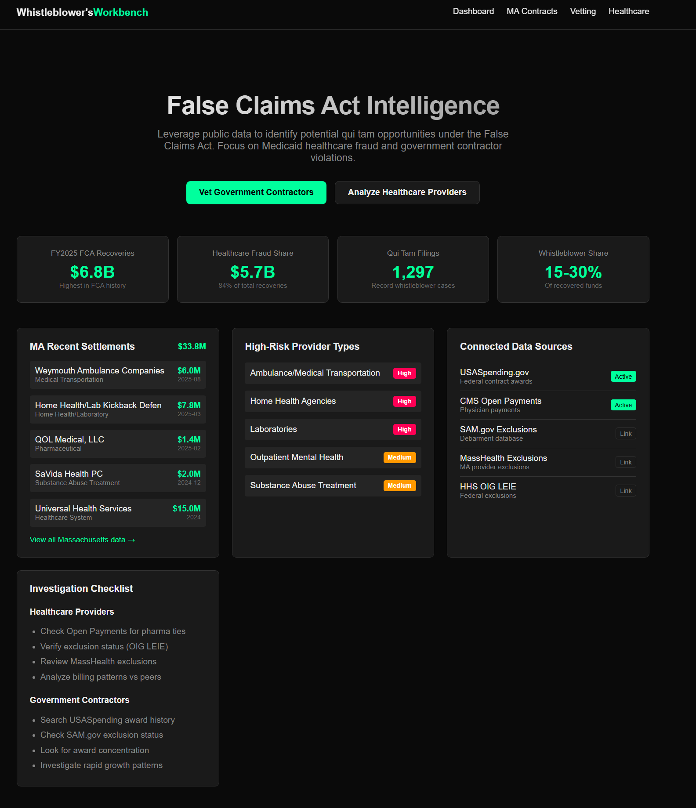

# Whistleblower's Workbench

**False Claims Act Intelligence Platform**

A full-stack investigative dashboard for identifying potential qui tam opportunities under the False Claims Act. Analyzes federal contract data, healthcare provider payments, and exclusion databases to surface fraud indicators in government spending.



## Overview

The False Claims Act allows private citizens (relators) to file lawsuits on behalf of the government against entities that have defrauded federal programs. Successful cases can result in significant recoveries, with whistleblowers receiving 15-30% of recovered funds.

This platform aggregates multiple federal data sources and applies anomaly detection algorithms to identify high-risk contractors and healthcare providers for further investigation.

## Features

### Government Contractor Analysis
- **USASpending.gov Integration** - Real-time federal contract data with filtering by state, agency, and award amount
- **Risk Scoring Algorithm** - ML-powered scoring based on statistical anomalies, sole-source ratios, and growth patterns
- **SAM.gov Cross-Reference** - Check contractors against federal debarment/exclusion database

### Healthcare Fraud Investigation
- **OIG LEIE Database** - 82,709 excluded providers with MA-specific filtering (1,702 Massachusetts exclusions)
- **Medicare Payment Analysis** - CMS provider utilization data with statistical outlier detection
- **Open Payments Lookup** - Pharmaceutical/device company payments to physicians (kickback indicators)
- **Review Sentiment Analysis** - Automated scanning of Google/Yelp reviews for billing complaint patterns

### Massachusetts Focus
- Recent FCA settlements tracking ($33.8M recovered)
- High-risk provider type identification (Home Health, Labs, DME, Ambulance)
- MassHealth exclusion cross-referencing

## Tech Stack

- **Frontend**: Next.js 15, React 19, CSS Variables
- **Backend**: Next.js API Routes, Server Actions
- **Data Sources**: USASpending.gov API, CMS Open Payments, NPPES NPI Registry, HHS OIG LEIE
- **ML Pipeline**: Custom fraud detection model trained on 82,709 exclusion records + historical FCA settlements

## Data Sources

| Source | Description | Status |
|--------|-------------|--------|
| USASpending.gov | Federal contract awards | Active API |
| CMS Open Payments | Physician pharma payments | Active API |
| HHS OIG LEIE | Federal exclusion list | Downloaded (82,709 records) |
| NPPES | NPI provider registry | Active API |
| SAM.gov | Debarment database | Link |
| MassHealth | MA provider exclusions | Link |

## Getting Started

```bash
# Install dependencies
npm install

# Download OIG exclusion data (required for healthcare analysis)
node src/ml/data/collect-oig-exclusions.js

# Train the fraud detection model
node src/ml/training/train-model.js

# Start development server
npm run dev
```

Open [http://localhost:3000](http://localhost:3000)

## Project Structure

```
src/
├── app/
│   ├── page.js                 # Main dashboard
│   ├── ma-contracts/           # MA federal contracts view
│   ├── healthcare-fraud/       # Healthcare provider investigation
│   ├── contractor-search/      # Contractor vetting
│   └── api/
│       ├── ma-contracts/       # Contract data API
│       ├── healthcare-providers/  # Provider lookup API
│       ├── healthcare-reviews/    # Review sentiment API
│       └── ml/score/           # ML scoring endpoint
├── ml/
│   ├── data/                   # Training data & OIG downloads
│   ├── models/                 # Trained model artifacts
│   └── training/               # Model training pipeline
├── actions/                    # Server actions
└── components/                 # Shared UI components
```

## Risk Scoring Methodology

### Contractor Risk Factors
- **Statistical Anomalies** (z-score > 2.5 from baseline)
- **Sole Source Concentration** (>50% non-competitive awards)
- **Rapid Growth** (>200% YoY increase)
- **Agency Concentration** (>80% from single agency)
- **High-Risk Categories** (consulting, IT services)

### Healthcare Risk Factors
- **OIG Exclusion Match** (Critical - federal program fraud conviction)
- **High Complexity Billing** (>40% Level 4-5 E&M codes)
- **Service Volume Anomalies** (>20 services per patient)
- **Pharma Payment Concentration** (>$50K from single company)
- **Review Sentiment** (billing complaint patterns)

## API Endpoints

```
POST /api/ma-contracts          # Fetch MA federal contracts with risk scores
POST /api/healthcare-providers  # Search providers, check exclusions
POST /api/healthcare-reviews    # Scan reviews for billing complaints
GET  /api/healthcare-providers/risky  # Pre-computed high-risk provider list
POST /api/ml/score              # Score arbitrary features against trained model
```

## Future Roadmap

### v2.0 - Enhanced Data Pipeline
- **Scheduled Data Ingestion** - Cron jobs for nightly OIG/USASpending sync with incremental updates
- **PostgreSQL Backend** - Replace in-memory data with persistent storage for historical trend analysis
- **Alert System** - Email/Slack notifications when new high-risk entities are detected

### v2.1 - Advanced Analytics
- **Network Graph Analysis** - Map relationships between contractors, subcontractors, and shell companies
- **NLP Document Analysis** - Extract fraud indicators from contract descriptions and modification justifications
- **Temporal Pattern Detection** - Identify suspicious timing (fiscal year-end spending spikes, post-award modifications)

### v3.0 - Multi-State Expansion
- **State Medicaid Integration** - Extend beyond Massachusetts to other state Medicaid exclusion databases
- **Multi-jurisdiction Search** - Cross-reference entities across state and federal exclusion lists simultaneously
- **Case Management Module** - Track investigation status, document findings, and generate qui tam attorney briefs

### Future Considerations
- **LLM-Powered Research Assistant** - Natural language queries against contract and payment databases
- **Public Records Integration** - Court filings, corporate registrations, bankruptcy records
- **Collaboration Features** - Multi-user workspaces for investigative teams

## Legal Disclaimer

This tool is for research and educational purposes. It identifies statistical patterns that may warrant further investigation but does not constitute evidence of fraud. All findings should be verified through proper legal channels before any action is taken. Consult with a qui tam attorney before filing any False Claims Act lawsuit.

## License

MIT
